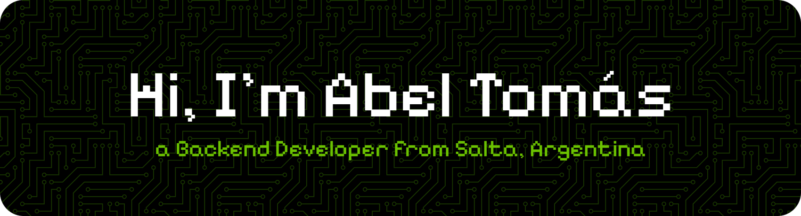

<!-- BANNER -->

  <picture>
    <source media="(prefers-color-scheme: dark)" srcset="github-header-banner.png">
    <source media="(prefers-color-scheme: light)" srcset="github-header-banner-light.png">
    
  </picture>

 

<!-- Projects Section
<h2 align="center">My projects</h2>

  
  
  

   -->

<!-- Skills section -->
<h2 align="center">My skills</h2>

<!-- Languages -->
<h4 align="center">Languages:</h4>

  <picture>
    <source media="(prefers-color-scheme: dark)" srcset="https://go-skill-icons.vercel.app/api/icons?i=py&theme=dark">
    
  </picture>
  <picture>
    <source media="(prefers-color-scheme: dark)" srcset="https://go-skill-icons.vercel.app/api/icons?i=java&theme=dark">
    
  </picture>
  <picture>
    <source media="(prefers-color-scheme: dark)" srcset="https://go-skill-icons.vercel.app/api/icons?i=postgres&theme=dark">
    
  </picture>
  <picture>
    <source media="(prefers-color-scheme: dark)" srcset="https://go-skill-icons.vercel.app/api/icons?i=mysql&theme=dark">
    
  </picture>
  <picture>
    <source media="(prefers-color-scheme: dark)" srcset="https://go-skill-icons.vercel.app/api/icons?i=sqlite&theme=dark">
    
  </picture>
  <picture>
    <source media="(prefers-color-scheme: dark)" srcset="https://go-skill-icons.vercel.app/api/icons?i=html&theme=dark">
    
  </picture>
  <picture>
    <source media="(prefers-color-scheme: dark)" srcset="https://go-skill-icons.vercel.app/api/icons?i=css&theme=dark">
    
  </picture>
  <picture>
    <source media="(prefers-color-scheme: dark)" srcset="https://go-skill-icons.vercel.app/api/icons?i=r&theme=dark">
    
  </picture>

<!-- Frameworks/Libraries -->
<h4 align="center">Frameworks/Libraries:</h4>

  <picture>
    <source media="(prefers-color-scheme: dark)" srcset="https://go-skill-icons.vercel.app/api/icons?i=fastapi&theme=dark">
    
  </picture>
  <picture>
    <source media="(prefers-color-scheme: dark)" srcset="https://go-skill-icons.vercel.app/api/icons?i=sqlalchemy&theme=dark">
    
  </picture>
  <picture>
    <source media="(prefers-color-scheme: dark)" srcset="https://go-skill-icons.vercel.app/api/icons?i=pytest&theme=dark">
    
  </picture>
  <picture>
    <source media="(prefers-color-scheme: dark)" srcset="https://go-skill-icons.vercel.app/api/icons?i=pandas&theme=dark">
    
  </picture>
  <picture>
    <source media="(prefers-color-scheme: dark)" srcset="https://go-skill-icons.vercel.app/api/icons?i=numpy&theme=dark">
    
  </picture>
  <picture>
    <source media="(prefers-color-scheme: dark)" srcset="https://go-skill-icons.vercel.app/api/icons?i=matplotlib&theme=dark">
    
  </picture>

<!-- Developer Tools -->
<h4 align="center">Developer Tools:</h4>

  <picture>
    <source media="(prefers-color-scheme: dark)" srcset="https://go-skill-icons.vercel.app/api/icons?i=git&theme=dark">
    
  </picture>
  <picture>
    <source media="(prefers-color-scheme: dark)" srcset="https://go-skill-icons.vercel.app/api/icons?i=github&theme=dark">
    
  </picture>
  <picture>
    <source media="(prefers-color-scheme: dark)" srcset="https://go-skill-icons.vercel.app/api/icons?i=linux&theme=dark">
    
  </picture>
  <picture>
    <source media="(prefers-color-scheme: dark)" srcset="https://go-skill-icons.vercel.app/api/icons?i=bash&theme=dark">
    
  </picture>
  <picture>
    <source media="(prefers-color-scheme: dark)" srcset="https://go-skill-icons.vercel.app/api/icons?i=docker&theme=dark">
    
  </picture>
  <picture>
    <source media="(prefers-color-scheme: dark)" srcset="https://go-skill-icons.vercel.app/api/icons?i=jira&theme=dark">
    
  </picture>

 

<!-- Stats section -->
<h2 align="center">My Activity</h2>

  <picture>
    <source media="(prefers-color-scheme: dark)" srcset="https://github-readme-stats-three-liart-61.vercel.app/api?username=atomudev&hide_rank=true&custom_title=Dev+Stats&title_color=ff9500&show_icons=true&icon_color=5586b4&count_private=true&theme=slateorange&hide_border=true&hide=issues&bg_color=00000000">
    
  </picture>
  <picture>
    <source media="(prefers-color-scheme: dark)" srcset="https://github-readme-stats-three-liart-61.vercel.app/api/top-langs/?username=atomudev&custom_title=Most+used+languages&title_color=ff9500&layout=compact&hide_border=true&theme=slateorange&bg_color=00000000&langs_count=10&exclude_repo=Pacman-AI&v=2">
    
  </picture>
  <picture>
    <source media="(prefers-color-scheme: dark)" srcset="https://streak-stats.demolab.com?user=atomudev&mode=weekly&theme=highcontrast&sideNums=5586b4&sideLabels=ff9500&hide_border=true&background=FFFFFF00">
    
  </picture>

 

<!-- AboutMe section-->
<h2 align="center">A little about me</h2>

  I'm a backend developer, working mainly with Python and its frameworks and libraries. I develop APIs with FastAPI, manage relational SQL databases (PostgreSQL and SQLite) and use Git as version control system, among other tools and technologies of the backend environment.
    
  Before dedicating myself to software development, I worked as a cashier in the collection of services and taxes and in an insurance office. These experiences helped me to develop skills in customer service and administrative management, as well as a strong responsibility, teamwork and problem solving skills on a daily basis.
    
  I'm currently pursuing a University Degree in Programming at Universidad Tecnológica Nacional (UTN), Argentina, reinforcing my academic training in parallel with my self-taught learning. I'm looking for my first professional experience in software development, to apply my knowledge, grow within a team and continue building my career as a software developer.
    
  That's a bit about me, thanks for stopping by! 😊🤍 

 

<!-- Social media -->

<h4 align="center">
  Connect with me:
</h4>

  
  

 
